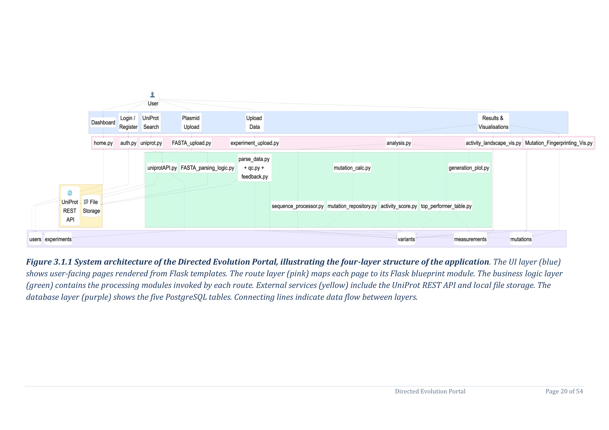

# Directed Evolution Portal

The **Directed Evolution Portal** is a web application for tracking and analysing protein engineering experiments. It guides researchers through a structured workflow — from retrieving a reference protein from UniProt, through plasmid validation and variant data upload, to automated ORF identification, mutation calling, activity scoring, and visualisation.

---

## What it does

Directed evolution generates large libraries of protein variants by iteratively mutating a gene and selecting for improved function. This portal provides the informatics backbone for that process:

1. **Fetch a reference protein** from UniProt by accession ID
2. **Validate a plasmid** by confirming the WT protein is encoded in the uploaded sequence
3. **Upload variant data** (DNA sequences, yields, generation metadata) from sequencing runs
4. **Run ORF analysis** to automatically identify the coding sequence in each variant plasmid and score it against the wild-type reference
5. **Call mutations** by aligning each variant protein to the WT and classifying differences
6. **Compute activity scores** normalising DNA/protein yields against WT baselines on a log2 scale

---

## System architecture

*Figure 3.1.1 — System architecture of the Directed Evolution Portal, illustrating the four-layer structure of the application. The UI layer (blue) shows user-facing pages rendered from Flask templates. The route layer (pink) maps each page to its Flask blueprint module. The business logic layer (green) contains the processing modules invoked by each route. External services (yellow) include the UniProt REST API and local file storage. The database layer (purple) shows the five PostgreSQL tables. Connecting lines indicate data flow between layers.*

---

## Tech stack

| Layer | Technology |
|---|---|
| Web framework | Flask 3.1.3 |
| Authentication | Flask-Login |
| Sessions | Flask-Session (filesystem) |
| Database | PostgreSQL 16 (Docker) |
| DB driver | psycopg 3 (dict_row cursor) |
| Sequence analysis | Biopython |
| Visualisation | Matplotlib, Plotly, scikit-learn |
| PDF reports | ReportLab |
| Deployment | Docker Compose + Gunicorn |

---

## Quick links

- [Getting Started](getting-started.md) — set up and run the app in minutes
- [Pipeline Overview](pipeline/overview.md) — understand the full experiment workflow
- [Mutation Calling](pipeline/mutation-calling.md) — protein-level variant classification
- [Activity Score](pipeline/activity-score.md) — log2-scaled scoring with WT baseline normalisation
- [Visualisations](pipeline/visualisations.md) — box plot, mutation fingerprint, activity landscape
- [Experiment History](pipeline/experiment-history.md) — save, rename, download reports
- [Database Schema](reference/database-schema.md) — full table and column reference
- [Test Data](reference/test-data.md) — GFP synthetic dataset for pipeline validation
