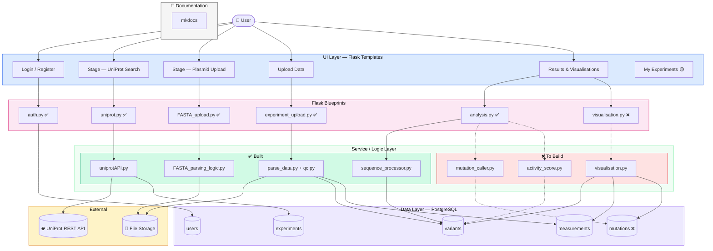

# Directed Evolution Portal

The **Directed Evolution Portal** is a web application for tracking and analysing protein engineering experiments. It guides researchers through a structured workflow — from retrieving a reference protein from UniProt, through plasmid validation and variant data upload, to automated ORF (open reading frame) identification and scoring.

---

## What it does

Directed evolution generates large libraries of protein variants by iteratively mutating a gene and selecting for improved function. This portal provides the informatics backbone for that process:

1. **Fetch a reference protein** from UniProt by accession ID
2. **Validate a plasmid** by confirming the WT protein is encoded in the uploaded sequence
3. **Upload variant data** (DNA sequences, yields, generation metadata) from sequencing runs
4. **Run ORF analysis** to automatically identify the coding sequence in each variant plasmid and score it against the wild-type reference

---

## Architecture overview

---

## Tech stack

| Layer | Technology |
|---|---|
| Web framework | Flask 3.x |
| Authentication | Flask-Login |
| Database | PostgreSQL 16 (Docker) |
| ORM / DB driver | psycopg3 |
| Sequence analysis | Biopython |
| Deployment | Docker Compose + Gunicorn |

---

## Quick links

- [Getting Started](getting-started.md) — set up and run the app in minutes
- [Pipeline Overview](pipeline/overview.md) — understand the full experiment workflow
- [ORF Analysis](pipeline/orf-analysis.md) — deep dive into the sequence processing engine
- [Database Schema](reference/database-schema.md) — full table and column reference
