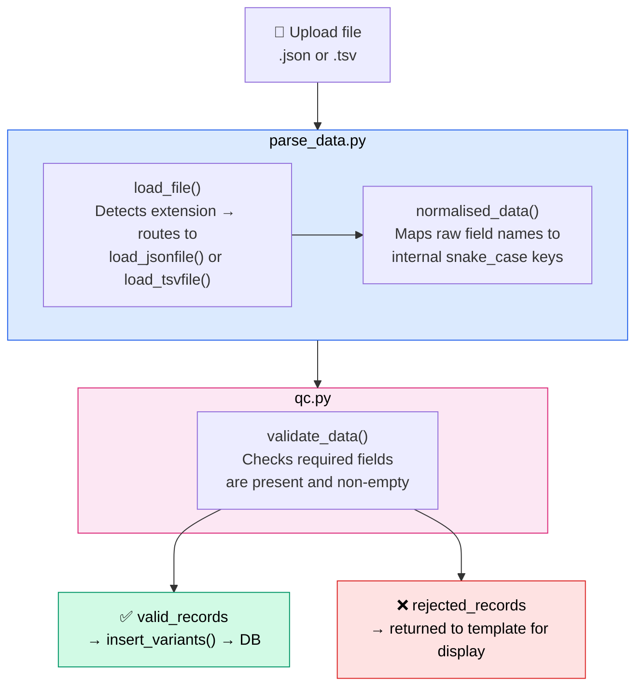

# Step 3: Experiment Data Upload

## What this step does

With the plasmid validated, you can now upload the **variant sequencing data** from your directed evolution run. Each row in the upload file represents one plasmid variant — including its DNA sequence, yield measurements, and generation metadata.

The portal parses and validates the file, rejects incomplete records, and inserts the valid variants into the database ready for ORF analysis.

---

## For scientists

1. After plasmid validation, click **Proceed to Experiment Data Upload**
2. Upload your variant data file (`.json` or `.tsv`)
3. The portal reports how many records were accepted and rejected
4. Rejected records are listed with the reason (e.g. missing DNA sequence)
5. Once uploaded, click **Run Step 1 ORF Analysis** to proceed

!!! tip "What to include in your file"
    At minimum, each variant needs:

    - The full assembled plasmid DNA sequence
    - The generation number (which round of evolution)
    - A unique plasmid variant index
    - A DNA yield measurement

    Optional but useful: protein sequence, protein yield, parent variant reference.

See [File Formats](../reference/file-formats.md) for exact column names and a template.

---

## For developers

### Route

| Method | URL | Handler |
|---|---|---|
| GET / POST | `/experiment_upload/` | `experiment_upload.experiment_upload` |

### Processing pipeline



### Parsing (`parse_data.py`)

`load_file()` detects the extension and routes to either `load_jsonfile()` or `load_tsvfile()`. The TSV loader checks for required column headers before reading rows.

`normalised_data()` maps raw field names to internal snake_case keys:

| Raw field | Internal key |
|---|---|
| `Assembled_DNA_Sequence` | `assembled_dna_sequence` |
| `Directed_Evolution_Generation` | `generation` |
| `DNA_Quantification_fg` | `dna_yield` |
| `Plasmid_Variant_Index` | `plasmid_variant_index` |
| `Protein_Sequence` | `protein_sequence` |
| `Protein_Quantification_pg` | `protein_yield` |
| `Parent_Plasmid_Variant` | `parent_variant_id` |

Any extra columns are collected into a `metadata` dict.

### QC validation (`qc.py`)

Records are rejected if any of these fields are missing or empty:

```python title="qc.py — required fields" linenums="1"
qc_fields = [
    "plasmid_variant_index",
    "assembled_dna_sequence",
    "generation",
    "dna_yield"
]
```

### Database insertion (`insert_variants`)

For each valid record, two rows are inserted in a single transaction:

```sql title="SQL — variant + measurement insert" linenums="1" hl_lines="1 9"
INSERT INTO variants (experiment_id, plasmid_variant_index, generation,
                      assembled_dna_sequence, protein_sequence, qc_passed)
VALUES (%s, %s, %s, %s, %s, %s)
RETURNING variant_id;

INSERT INTO measurements (variant_id, dna_yield, protein_yield, is_control)
VALUES (%s, %s, %s, %s);
```

!!! note "parent_variant_id"
    The `parent_variant_id` field is stored as `NULL` at upload time. Parent-child relationships across generations are intended to be resolved in a later pipeline step.

### Error handling

| Condition | Behaviour |
|---|---|
| No file uploaded | `ValueError` caught, error feedback shown |
| Unsupported file type | `ValueError` from `load_file` |
| Invalid JSON | `ValueError` with decode error detail |
| TSV missing required columns | `ValueError` listing missing columns |
| Individual row insert fails | Row skipped, counted in `db_skipped` |
