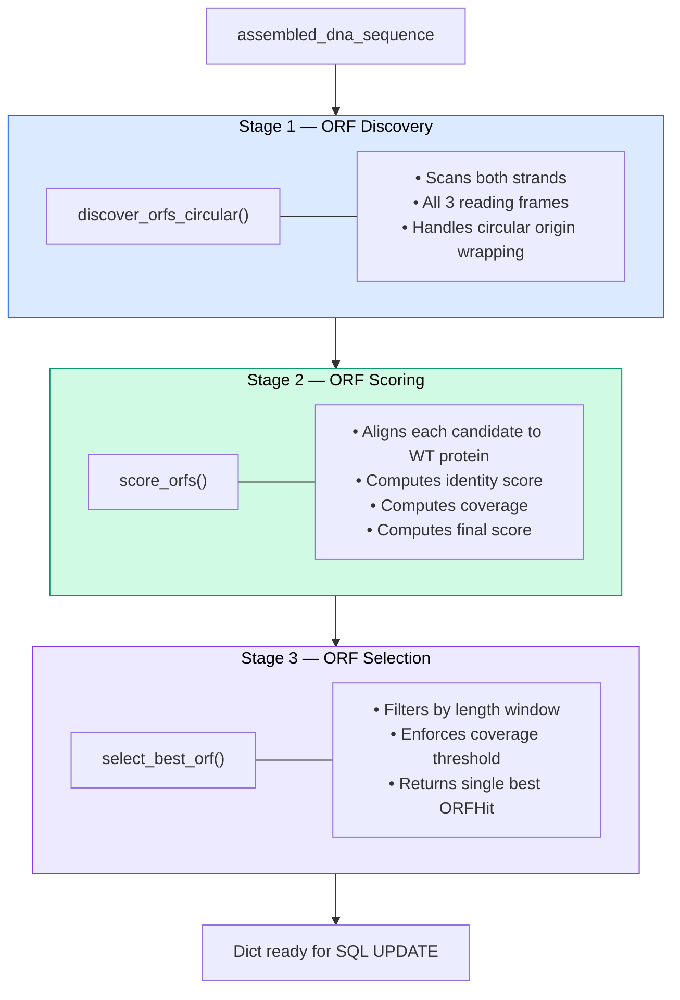

# Step 4: ORF Analysis

## What this step does

ORF (Open Reading Frame) analysis is the first step of the computational analysis pipeline. For each variant in the experiment, it:

1. Scans the full plasmid DNA sequence for all candidate protein-coding regions
2. Translates each candidate and aligns it to the WT reference protein
3. Scores and selects the single best-matching ORF as the target coding sequence
4. Writes the identified ORF coordinates, sequence, and quality metrics back to the database

This step identifies *which part* of each variant's plasmid is the gene of interest, and how well it matches the WT — laying the groundwork for mutation calling in later pipeline steps.

---

## For scientists

### Running the analysis

After uploading experiment data, click **Run Step 1 ORF Analysis** on the upload page. The portal will process all variants in the experiment and redirect to a results table showing:

| Column | What it means |
|---|---|
| **Status** | `ok` = ORF found successfully; `error` = analysis failed |
| **Score** | Alignment identity vs WT (0–1). `1.0` = identical to WT at every aligned position |
| **Coverage** | Fraction of the WT sequence covered by the alignment (0–1). `1.0` = full-length match |
| **Final** | Combined score used for selection (`score × length similarity`) |
| **Protein Len** | Length of the identified ORF protein in amino acids |
| **Strand** | `+` = forward strand; `-` = reverse complement |
| **Frame** | Reading frame offset (0, 1, or 2) |
| **ORF Start / End** | Position of the coding sequence within the circular plasmid |

### Interpreting results

- A **score close to 1.0** with **coverage close to 1.0** indicates a high-confidence ORF identification with minimal mutation load
- **Lower scores** indicate variants with more mutations — expected in later generations of directed evolution
- An **error status** means no ORF passed the selection filters. Common causes: severely truncated sequence, frameshifts, or a misassembled variant

!!! tip "Pending variants"
    Variants show as "pending" until analysis is run. Re-running analysis on an experiment overwrites previous results for all variants.

---

## For developers

### Route

| Method | URL | Handler |
|---|---|---|
| POST | `/analysis/step1/run_experiment/<id>` | `analysis.run_step1_experiment` |
| GET | `/analysis/results/experiment/<id>` | `analysis.results_experiment` |

### Processing flow

```python title="analysis.py" linenums="1"
policy = SelectionPolicy()

for v in variants:
    out = run_step1_for_variant_row(
        wt_protein_sequence=wt_protein,
        assembled_dna_sequence=v["assembled_dna_sequence"],
        policy=policy
    )
    _write_step1_result(db, v["variant_id"], out)

db.commit()
```

All variants are processed synchronously in a single request. For large experiments this may be slow — consider background task processing (e.g. Celery) for production scale.

---

## sequence_processor.py — architecture

The analysis engine lives entirely in `sequence_processor.py` and is structured as a three-stage pipeline:



---

### Stage 1: ORF Discovery

**Circular plasmid handling:**

Plasmids are circular, so a coding sequence may span the origin (position 0). The algorithm handles this by extending the sequence with a prefix copy:

```python title="sequence_processor.py — circular extension" linenums="1" hl_lines="2 3"
wrap_bases = min(len(dna), len(wt_protein) * 3 + 300)
extended = dna + dna[:wrap_bases]  # (1)
hits = discover_orfs_circular(dna, min_aa=policy.min_aa, wrap_bases=wrap_bases)
```

1. Duplicating a prefix means ORFs that cross the plasmid origin appear as continuous regions in linear scanning — the same approach used by Prodigal.

**Both strands and all three reading frames:**

ORFs are scanned on the forward strand and the reverse complement, across frames 0, 1, and 2. An ORF is defined as a methionine (`M`) followed by a stop codon (`*`), at least `min_aa` residues long (default: 200 aa).

---

### Stage 2: ORF Scoring

Each candidate ORF protein is globally aligned to the WT protein using `Bio.Align.PairwiseAligner`:

```python title="sequence_processor.py — aligner config" linenums="1"
aligner = PairwiseAligner()
aligner.mode = "global"
aligner.match_score = 1
aligner.mismatch_score = -1
aligner.open_gap_score = -2
aligner.extend_gap_score = -0.5
```

Three metrics are computed, all normalised by WT length:

| Metric | Formula | Meaning |
|---|---|---|
| `score` | matches / WT length | Alignment identity |
| `coverage` | aligned non-gap positions / WT length | Fraction of WT covered |
| `final` | score × length_similarity | Combined ranking metric |

`length_similarity` penalises ORFs much longer or shorter than WT:

```python title="sequence_processor.py — length penalty" linenums="1"
length_similarity = max(0.0, 1.0 - abs(len(orf) - wt_len) / wt_len)
```

!!! note "Why WT-normalised metrics?"
    Normalising by WT length rather than alignment length prevents short ORFs from scoring highly by matching only a small but perfect fragment of the WT.

---

### Stage 3: ORF Selection

Candidates are filtered by the `SelectionPolicy`:

```python title="sequence_processor.py — SelectionPolicy" linenums="1"
@dataclass(frozen=True)
class SelectionPolicy:
    min_aa: int = 200                            # minimum ORF length
    coverage_threshold: float = 0.6              # minimum alignment coverage
    length_window: Tuple[float, float] = (0.7, 1.3)  # acceptable length range vs WT
```

Selection logic:

1. Filter to ORFs within `[0.7×wt_len, 1.3×wt_len]` amino acids
2. Pick the ORF with highest `coverage`, breaking ties with `final`
3. Reject if best coverage is below `0.6`

---

### SelectionPolicy tuning

| Parameter | Default | When to change |
|---|---|---|
| `min_aa` | 200 | Lower for small proteins (<200 aa) |
| `coverage_threshold` | 0.6 | Lower if variants are highly diverged; raise for stricter QC |
| `length_window` | (0.7, 1.3) | Widen if expecting large insertions/deletions |

---

### ORFHit dataclass

```python title="sequence_processor.py — ORFHit" linenums="1"
@dataclass
class ORFHit:
    cds_dna: str        # coding DNA sequence
    protein: str        # translated protein
    start: int          # 0-based circular start coordinate
    end: int            # 0-based circular end coordinate
    strand: str         # '+' or '-'
    frame: int          # reading frame (0, 1, 2)
    score: float        # alignment identity (WT-normalised)
    coverage: float     # alignment coverage (WT-normalised)
    final: float        # combined selection score
```

---

### Fields written to the database

All `orf_*` columns in the `variants` table are populated by this step:

```sql title="SQL UPDATE — orf fields" linenums="1" hl_lines="2 3 4 5"
UPDATE variants SET
  step1_status        = %(step1_status)s,
  step1_error         = %(step1_error)s,
  orf_start           = %(orf_start)s,
  orf_end             = %(orf_end)s,
  orf_strand          = %(orf_strand)s,
  orf_frame           = %(orf_frame)s,
  orf_score           = %(orf_score)s,
  orf_coverage        = %(orf_coverage)s,
  orf_final           = %(orf_final)s,
  orf_protein_len     = %(orf_protein_len)s,
  orf_cds_dna         = %(orf_cds_dna)s,
  orf_protein_sequence = %(orf_protein_sequence)s
WHERE variant_id = %(variant_id)s
```

See [Database Schema](../reference/database-schema.md) for full column definitions.

---

## Using sequence_processor.py directly

The module can also be used as a standalone Python library outside of Flask, for example in scripts or notebooks.

### Quick start

```python title="quick_start.py" linenums="1"
from sequence_processor import SequenceProcessor

# Bind the WT protein once per experiment
processor = SequenceProcessor(wt_protein_sequence="MKKLAVLGLCLAAALCGGEAQA...")

# Find the target ORF in a plasmid variant
orf = processor.find_target_orf_in_plasmid("ATGAAAAAACTGGCAGTG...")

print(f"ORF at {orf.start}–{orf.end} on strand {orf.strand}")
print(f"Score: {orf.score:.3f}  Coverage: {orf.coverage:.3f}")
print(f"Protein: {orf.protein[:40]}...")
```

### Custom SelectionPolicy

```python title="custom_policy.py" linenums="1"
from sequence_processor import SequenceProcessor, SelectionPolicy

policy = SelectionPolicy(
    min_aa=150,              # lower for small proteins
    coverage_threshold=0.7,  # stricter coverage requirement
    length_window=(0.8, 1.2) # tighter length tolerance
)

orf = processor.find_target_orf_in_plasmid(plasmid_dna, policy=policy)
```

### Custom scoring function

```python title="custom_scorer.py" linenums="1"
from typing import Tuple

def custom_scorer(query_protein: str, wt_protein: str) -> Tuple[float, float]:
    """Must return (score, coverage), both in range [0.0, 1.0]."""
    # plug in any alignment library here
    return score, coverage

orf = processor.find_target_orf_in_plasmid(plasmid_dna, scorer=custom_scorer)
```

### Batch processing variants

```python title="batch_processing.py" linenums="1"
from sequence_processor import SequenceProcessor, SelectionPolicy

processor = SequenceProcessor(wt_protein_sequence=wt_protein)
policy = SelectionPolicy()

for variant in variants:
    try:
        orf = processor.find_target_orf_in_plasmid(
            variant.assembled_dna_sequence,
            policy=policy
        )
        variant.orf_start   = orf.start
        variant.orf_end     = orf.end
        variant.orf_protein = orf.protein
        variant.orf_score   = orf.score
        variant.status      = "success"

    except ValueError as e:
        variant.status = "failed"
        variant.error  = str(e)

    variant.save()
```

---

## Coordinate system

ORF coordinates use **0-based circular indexing**. For a 5000 bp plasmid, an ORF crossing the origin might look like:

```
start = 4800   # near the end of the plasmid
end   = 200    # wraps around to the beginning
# → represents a ~400 bp ORF spanning the origin
```

To extract the corresponding DNA from the plasmid:

```python title="sequence_processor.py — extract circular region" linenums="1"
from sequence_processor import extract_circular_region

cds = extract_circular_region(plasmid_dna, start=4800, end=200)
# Returns: plasmid_dna[4800:] + plasmid_dna[:200]
```

---

## Error handling

`find_target_orf_in_plasmid` raises `ValueError` with descriptive messages. The Flask adapter (`_run_step1_safe`) catches all exceptions and converts them to an `error` status — so failures are always recorded in the database rather than crashing the request.

```python title="error_handling.py" linenums="1"
try:
    orf = processor.find_target_orf_in_plasmid(plasmid_dna)
except ValueError as e:
    if "No ORFs found" in str(e):
        pass  # no candidates passed minimum length filter
    elif "coverage" in str(e):
        pass  # best ORF had insufficient alignment coverage
    elif "length_window" in str(e):
        pass  # no ORFs fell within the acceptable length range
```

---

## Biological rationale for default thresholds

### Minimum ORF length — `min_aa = 200`

DNA polymerases and other typical directed evolution targets are 600–1000+ amino acids. Setting the floor at 200 aa eliminates the vast majority of spurious ORFs without risking exclusion of real targets.

### Coverage threshold — `coverage_threshold = 0.6`

A coverage of 0.6 means the candidate aligns to at least 60% of the WT protein length. Values below this risk selecting partial matches or fragments that happen to score well on a small region.

### Length window — `length_window = (0.7, 1.3)`

Typical directed evolution variants carry small point mutations or short indels — not large-scale deletions or concatemers. The 70–130% window filters out:

- **Below 70%** — truncations, premature stop codons, assembly errors
- **Above 130%** — concatemers, insertions of large foreign sequences

---

## References

| Source | Used for |
|---|---|
| [Biopython Tutorial — ORF finding](https://biopython.org/docs/latest/Tutorial/chapter_cookbook.html) | Core `find_orfs_with_trans()` pattern; `Bio.Seq.translate()` and `reverse_complement()` |
| [Biopython Pairwise Alignment](https://biopython.org/docs/latest/Tutorial/chapter_pairwise.html) | `Bio.Align.PairwiseAligner` API and global alignment configuration |
| [Pyrodigal / Prodigal](https://pyrodigal.readthedocs.io/) | Circular plasmid handling via sequence extension (same approach used by Prodigal, Prokka, RAST) |
| Larralde (2022), *Journal of Open Source Software*, 7(72), 4296 | Pyrodigal citation — circular feature handling |
| [Biostars — ORF finding examples](https://www.biostars.org/p/398203/) | M-to-stop scanning approach; more robust than stop-to-stop |
