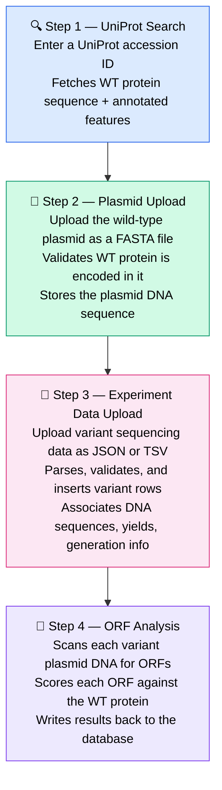
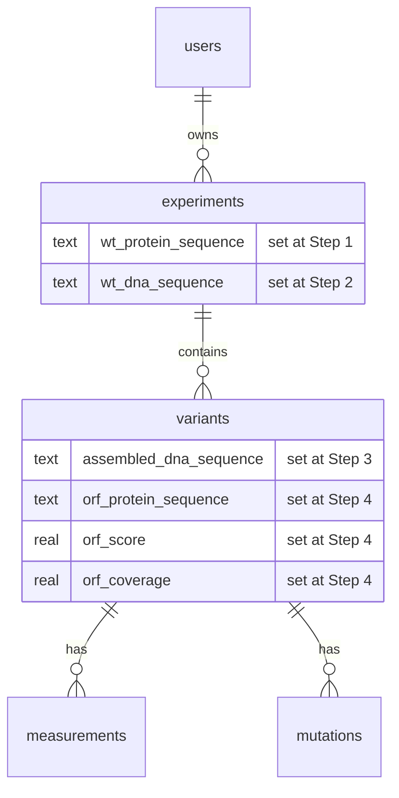

# Pipeline Overview

The Directed Evolution Portal implements a four-step workflow that takes a researcher from a protein accession number all the way to scored ORF results for every variant in an experiment.

---

## The full workflow

---

## Why this order matters

Each step depends on the one before it:

- **ORF analysis** requires knowing the WT protein (from UniProt) and the variant DNA sequences (from experiment upload)
- **Plasmid validation** requires the WT protein to confirm the plasmid is correct before any variants are uploaded
- **Experiment upload** is gated behind successful plasmid validation to prevent bad data entering the database

The app enforces this sequence via session state — attempting to skip steps redirects back to the appropriate stage.

---

## Data flow through the database

---

## Step-by-step guides

| Step | What happens | Guide |
|---|---|---|
| 1 | Fetch WT protein + features from UniProt | [UniProt Search](uniprot.md) |
| 2 | Upload & validate the WT plasmid FASTA | [Plasmid Upload](plasmid-upload.md) |
| 3 | Upload variant sequencing data | [Experiment Upload](experiment-upload.md) |
| 4 | Run automated ORF analysis | [ORF Analysis](orf-analysis.md) |
