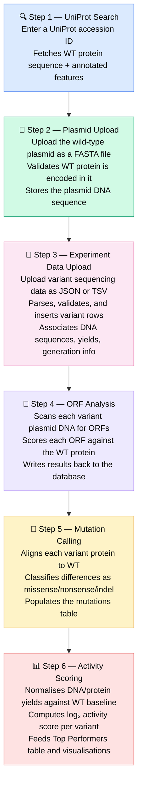
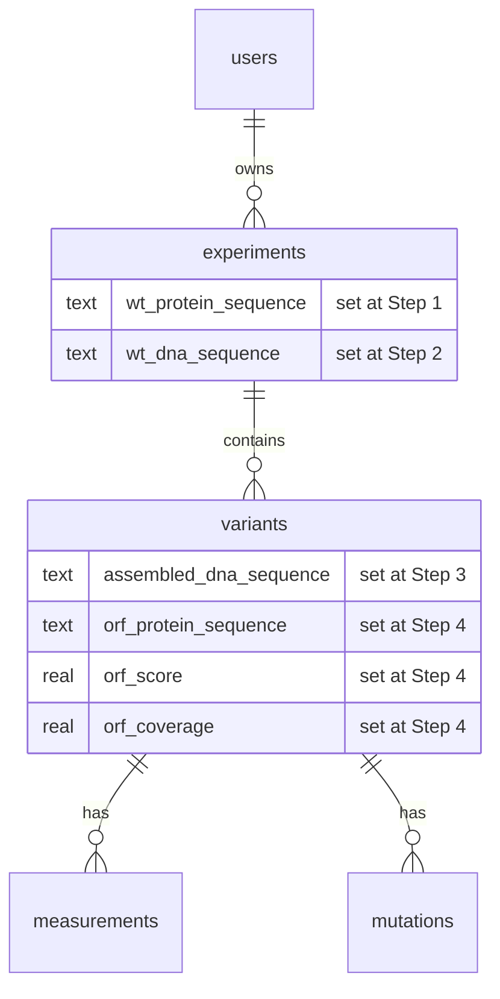

# Pipeline Overview

The Directed Evolution Portal implements a multi-step workflow that takes a researcher from a protein accession number through variant upload, automated ORF detection, mutation calling, activity scoring, and final visualisations.

---

## System architecture

The portal is organised into four layers: a **UI layer** of user-facing pages, a **route layer** mapping each page to a Flask blueprint, a **business logic layer** containing the processing modules invoked by each route, and a **database layer** of five PostgreSQL tables. Two **external services** — the UniProt REST API and local file storage — sit alongside the business logic.

```mermaid
flowchart TB
    User(["👤 User"])

    subgraph UI["🖥️ UI Layer — Flask templates"]
        direction LR
        U1["Dashboard"]
        U2["Login / Register"]
        U3["UniProt Search"]
        U4["Plasmid Upload"]
        U5["Upload Data"]
        U6["Results & Visualisations"]
    end

    subgraph Routes["🔀 Route Layer — Flask blueprints"]
        direction LR
        R1["home.py"]
        R2["auth.py"]
        R3["uniprot.py"]
        R4["FASTA_upload.py"]
        R5["experiment_upload.py"]
        R6["analysis.py"]
        R7["activity_landscape_vis.py"]
        R8["Mutation_Fingerprinting_Vis.py"]
    end

    subgraph Logic["⚙️ Business Logic Layer — processing modules"]
        direction LR
        L1["uniprotAPI.py"]
        L2["FASTA_parsing_logic.py"]
        L3["parse_data.py<br/>qc.py<br/>feedback.py"]
        L4["mutation_calc.py"]
        L5["sequence_processor.py"]
        L6["mutation_repository.py"]
        L7["activity_score.py"]
        L8["top_performer_table.py"]
        L9["generation_plot.py"]
    end

    subgraph External["🌐 External Services"]
        direction LR
        E1["UniProt REST API"]
        E2["File Storage"]
    end

    subgraph DB["🗄️ Database Layer — PostgreSQL"]
        direction LR
        D1["users"]
        D2["experiments"]
        D3["variants"]
        D4["measurements"]
        D5["mutations"]
    end

    User --> UI
    U1 --> R1
    U2 --> R2
    U3 --> R3
    U4 --> R4
    U5 --> R5
    U6 --> R6
    U6 --> R7
    U6 --> R8

    R3 --> L1
    R4 --> L2
    R5 --> L3
    R6 --> L4
    R6 --> L5
    R6 --> L6
    R6 --> L7
    R6 --> L8
    R7 --> L5
    R8 --> L4

    L1 --> E1
    L2 --> E2
    L3 --> E2

    R1 --> D2
    R2 --> D1
    R3 --> D2
    L5 --> D3
    L6 --> D5
    L7 --> D3
    L3 --> D3
    L3 --> D4
    L9 --> D3

    classDef uiStyle fill:#dbeafe,stroke:#2563eb,color:#000
    classDef routeStyle fill:#fce7f3,stroke:#db2777,color:#000
    classDef logicStyle fill:#d1fae5,stroke:#059669,color:#000
    classDef extStyle fill:#fef3c7,stroke:#d97706,color:#000
    classDef dbStyle fill:#ede9fe,stroke:#7c3aed,color:#000

    class U1,U2,U3,U4,U5,U6 uiStyle
    class R1,R2,R3,R4,R5,R6,R7,R8 routeStyle
    class L1,L2,L3,L4,L5,L6,L7,L8,L9 logicStyle
    class E1,E2 extStyle
    class D1,D2,D3,D4,D5 dbStyle
```

*System architecture of the Directed Evolution Portal, illustrating the four-layer structure of the application. The UI layer (blue) shows user-facing pages rendered from Flask templates. The route layer (pink) maps each page to its Flask blueprint module. The business logic layer (green) contains the processing modules invoked by each route. External services (yellow) include the UniProt REST API and local file storage. The database layer (purple) shows the five PostgreSQL tables.*

---

## The full workflow

---

## Why this order matters

Each step depends on the one before it:

- **ORF analysis** requires knowing the WT protein (from UniProt) and the variant DNA sequences (from experiment upload)
- **Plasmid validation** requires the WT protein to confirm the plasmid is correct before any variants are uploaded
- **Experiment upload** is gated behind successful plasmid validation to prevent bad data entering the database

The app enforces this sequence via session state — attempting to skip steps redirects back to the appropriate stage.

---

## Data flow through the database

---

## Step-by-step guides

| Step | What happens | Guide |
|---|---|---|
| 1 | Fetch WT protein + features from UniProt | [UniProt Search](uniprot.md) |
| 2 | Upload & validate the WT plasmid FASTA | [Plasmid Upload](plasmid-upload.md) |
| 3 | Upload variant sequencing data | [Experiment Upload](experiment-upload.md) |
| 4 | Run automated ORF analysis | [ORF Analysis](orf-analysis.md) |
| 5 | Call mutations via WT protein alignment | [Mutation Calling](mutation-calling.md) |
| 6 | Compute activity scores and rank variants | [Activity Score](activity-score.md) |
| — | Explore results visually (box plot, fingerprint, landscape) | [Visualisations](visualisations.md) |
| — | Save, rename, report, or delete past experiments | [Experiment History](experiment-history.md) |
