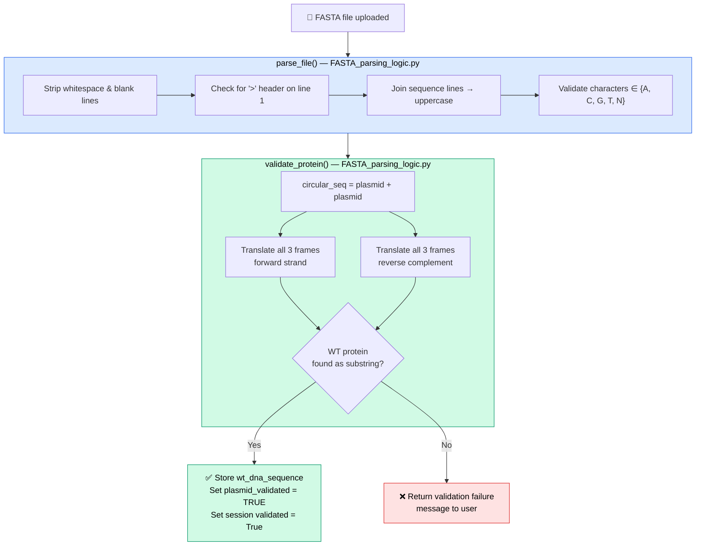

# Step 2: Plasmid Upload

## What this step does

Before any variant data can be uploaded, the **wild-type plasmid** must be validated. This step confirms that the plasmid FASTA file you're working with actually encodes the WT protein retrieved from UniProt — catching any mismatches between the reference protein and the vector before analysis begins.

If validation passes, the plasmid DNA sequence is stored in the database and the experiment is marked as validated.

---

## For scientists

1. After confirming your UniProt protein, you'll be redirected to the plasmid upload page
2. Upload your plasmid sequence as a `.fasta`, `.fa`, or `.fna` file
3. The portal will search for your WT protein within the plasmid sequence
4. If found, you'll see a green confirmation and a button to proceed to data upload

!!! note "Circular plasmids"
    The validator handles **circular plasmids** correctly. It checks all three reading frames on both strands of a doubled sequence, so ORFs that cross the plasmid origin are detected.

!!! warning "If validation fails"
    A failure means the WT protein sequence from UniProt was not found in any reading frame of the uploaded plasmid. Common causes:

    - Wrong plasmid file uploaded
    - Wrong UniProt ID used in Step 1
    - Truncated or corrupted FASTA file
    - The protein in your plasmid differs from the canonical UniProt sequence (e.g. a different isoform or codon-optimised variant)

---

## Accepted file format

| Property | Requirement |
|---|---|
| Extension | `.fasta`, `.fa`, or `.fna` |
| Header | Must have a `>` header line |
| Sequence | Nucleotides only: `A`, `C`, `G`, `T`, `N` (uppercase or lowercase) |
| Topology | Circular plasmids supported |

See [File Formats](../reference/file-formats.md) for a full example.

---

## For developers

### Route

| Method | URL | Handler |
|---|---|---|
| GET / POST | `/plasmid_upload/` | `FASTA_upload.plasmid_upload` |

### Validation logic



**Why substring matching?**

```python title="FASTA_parsing_logic.py — circular validation" linenums="1" hl_lines="1"
circular_seq = plasmid_sequence + plasmid_sequence  # handles origin-crossing ORFs
```

The WT protein may be flanked by signal peptides, tags, or other coding regions in the plasmid vector. Substring matching rather than exact equality handles these cases correctly.

### What gets stored on success

```sql title="SQL — update on validation success" linenums="1"
UPDATE experiments
SET wt_dna_sequence = %s,
    plasmid_validated = TRUE
WHERE experiment_id = %s
```

```python title="FASTA_upload.py — session flag" linenums="1"
session["validated"] = True
```

This flag gates access to the experiment upload page — `experiment_upload.py` redirects back to plasmid upload if `session["validated"]` is falsy.

### Error handling

| Condition | Behaviour |
|---|---|
| No file selected | Raises `ValueError`, shown as error message |
| Wrong file extension | Raises `ValueError` |
| Empty FASTA file | `parse_file` raises `ValueError("Empty fasta file")` |
| Missing header | `parse_file` raises `ValueError("Missing FASTA header")` |
| Invalid nucleotides | `parse_file` raises `ValueError("Sequence contains invalid nucleotide characters")` |
| Protein not found | Returns `success: False` with explanation message |
| Experiment not in session | Redirects to UniProt search |
