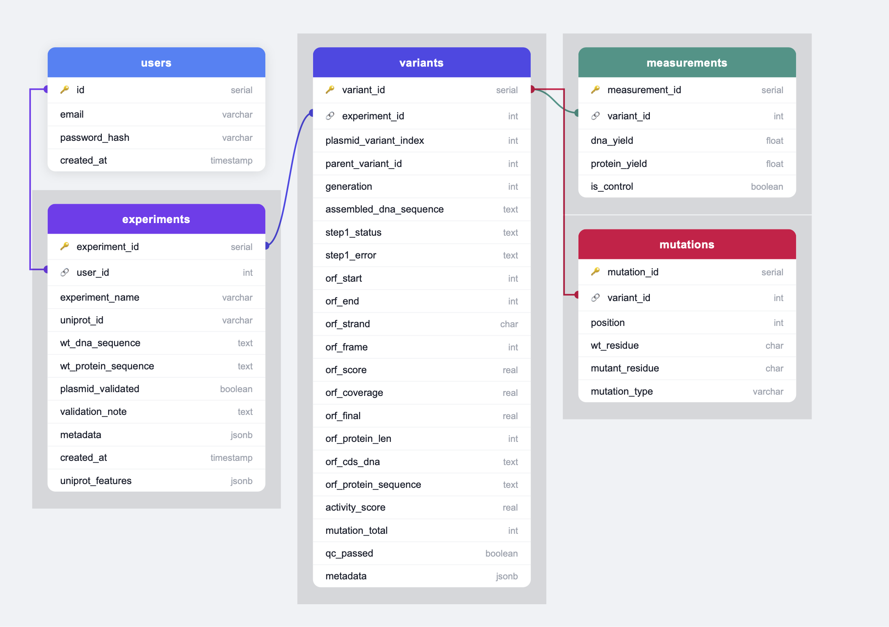

# Database Schema

The portal uses a PostgreSQL 16 database comprising five tables. The schema is defined in `schema.sql` and is applied automatically on first container startup.

---

## Entity relationship diagram

---

## users

Stores registered user accounts.

| Column | Type | Description |
|---|---|---|
| `id` | `SERIAL PK` | Auto-incrementing user ID |
| `email` | `VARCHAR(255) UNIQUE NOT NULL` | Login email address |
| `password_hash` | `VARCHAR(255) NOT NULL` | Werkzeug-hashed password |
| `created_at` | `TIMESTAMP` | Account creation time |

---

## experiments

One row per experiment, created at UniProt confirmation. Represents a single directed evolution campaign targeting one protein.

| Column | Type | Description |
|---|---|---|
| `experiment_id` | `SERIAL PK` | Auto-incrementing experiment ID |
| `user_id` | `INTEGER FK → users.id` | Owning user |
| `experiment_name` | `VARCHAR(255) NOT NULL` | Auto-generated: `"Experiment – {uniprot_id}"` |
| `uniprot_id` | `VARCHAR(20) NOT NULL` | UniProt accession ID (e.g. `P00533`) |
| `wt_protein_sequence` | `TEXT NOT NULL` | Wild-type protein sequence from UniProt |
| `wt_dna_sequence` | `TEXT NOT NULL DEFAULT ''` | Wild-type plasmid DNA; populated at plasmid upload |
| `uniprot_features` | `JSONB` | Array of `{feature_type, start_location, end_location}` from UniProt |
| `plasmid_validated` | `BOOLEAN DEFAULT FALSE` | Set to `TRUE` after successful FASTA validation |
| `validation_note` | `TEXT` | Optional note from validation step |
| `metadata` | `JSONB` | Reserved for future use |
| `created_at` | `TIMESTAMP` | Experiment creation time |
| `saved_at` | `TIMESTAMP` | Set when the user saves the experiment; `NULL` until saved. Only experiments with non-NULL `saved_at` appear in the Past Experiments list |

---

## variants

One row per plasmid variant within an experiment. Stores the assembled DNA sequence, ORF detection results, and QC metadata. The table is subdivided into four logical groups of columns.

### Identity and lineage

| Column | Type | Description |
|---|---|---|
| `variant_id` | `SERIAL PK` | Auto-incrementing variant ID |
| `experiment_id` | `INTEGER FK → experiments.experiment_id` | Parent experiment |
| `plasmid_variant_index` | `INTEGER` | Unique index from the uploaded data file |
| `parent_variant_id` | `INTEGER FK → variants.variant_id` | Parent variant (`NULL` until lineage resolution) |
| `generation` | `INTEGER NOT NULL` | Directed evolution generation number |

### Sequence data

| Column | Type | Description |
|---|---|---|
| `assembled_dna_sequence` | `TEXT NOT NULL` | Full assembled plasmid DNA sequence |
| `protein_sequence` | `TEXT NOT NULL DEFAULT ''` | Protein sequence if provided in upload file |

### ORF detection results

All columns in this group are `NULL` until ORF detection is executed.

| Column | Type | Description |
|---|---|---|
| `step1_status` | `TEXT` | `'ok'` or `'error'` |
| `step1_error` | `TEXT` | Error message if `step1_status = 'error'` |
| `orf_start` | `INTEGER` | 0-based start coordinate of ORF in circular plasmid |
| `orf_end` | `INTEGER` | 0-based end coordinate of ORF in circular plasmid |
| `orf_strand` | `CHAR(1)` | `'+'` (forward) or `'-'` (reverse complement) |
| `orf_frame` | `INTEGER` | Reading frame: `0`, `1`, or `2` |
| `orf_score` | `REAL` | Alignment identity vs WT (0–1, WT-normalised) |
| `orf_coverage` | `REAL` | Alignment coverage vs WT (0–1, WT-normalised) |
| `orf_final` | `REAL` | Combined selection score (`score × length_similarity`) |
| `orf_protein_len` | `INTEGER` | Length of identified ORF protein (amino acids) |
| `orf_cds_dna` | `TEXT` | Coding DNA sequence of the identified ORF |
| `orf_protein_sequence` | `TEXT` | Translated protein sequence of the identified ORF |

### QC and metadata

| Column | Type | Description |
|---|---|---|
| `activity_score` | `REAL` | Activity score computed by the scoring pipeline |
| `mutation_total` | `INTEGER` | Total mutation count populated by mutation calling |
| `qc_passed` | `BOOLEAN DEFAULT TRUE` | Set to `FALSE` for records rejected by QC |
| `qc_reason` | `TEXT` | Reason if `qc_passed = FALSE` |
| `metadata` | `JSONB` | Extra columns from upload file not mapped to known fields |

---

## measurements

One measurement row is inserted per variant at upload time.

| Column | Type | Description |
|---|---|---|
| `measurement_id` | `SERIAL PK` | Auto-incrementing ID |
| `variant_id` | `INTEGER FK → variants.variant_id` | Associated variant |
| `dna_yield` | `FLOAT` | DNA yield in femtograms (fg) |
| `protein_yield` | `FLOAT` | Protein yield in picograms (pg) |
| `is_control` | `BOOLEAN DEFAULT FALSE` | Whether this variant is a control |

---

## mutations

Populated by [mutation calling](../pipeline/mutation-calling.md) after ORF detection identifies the coding sequence and aligns the variant protein against the WT reference.

| Column | Type | Description |
|---|---|---|
| `mutation_id` | `SERIAL PK` | Auto-incrementing ID |
| `variant_id` | `INTEGER FK → variants.variant_id` | Associated variant |
| `position` | `INTEGER NOT NULL` | Amino acid position (1-based) |
| `wt_residue` | `CHAR(1)` | Wild-type amino acid |
| `mutant_residue` | `CHAR(1)` | Mutant amino acid |
| `mutation_type` | `VARCHAR(20)` | `'missense'`, `'nonsense'`, `'insertion'`, or `'deletion'` |
